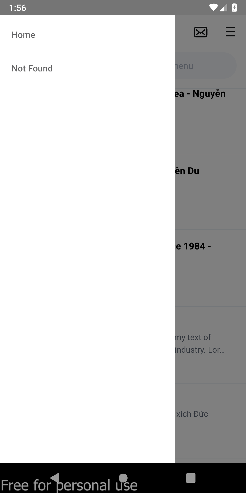

![][1]

## Demo Baemin With CLI

###### 1. npm install or yarn install

###### 2. Run metro with CLI: npx react-native start or npm start or yarn start

###### 3. Open new terminal, run: npx react-native android or npm android or yarn android

**Make sure your emulator is running (android studio or genymotion)**

###### 4. File apk for android

[here](./baemin-v1-release.apk)
